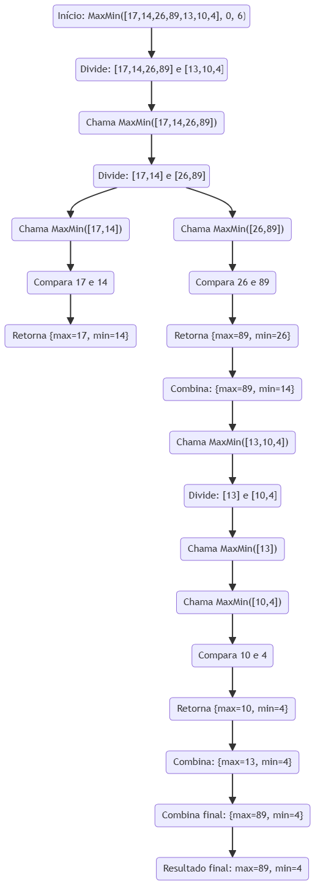

# Projeto MaxMin Select

## Sobre o algoritmo
O algoritmo de seleção simultânea (MaxMin Select) pode ser implementado de forma recursiva, utilizando a técnica de divisão e conquista. O problema é dividido em subproblemas menores que são resolvidos recursivamente, e seus resultados são combinados para encontrar o maior e o menor elementos com eficiência. Esse método reduz o número de comparações necessárias em comparação com uma abordagem ingênua.

## Como ele funciona
A técnica de divisão e conquista no algoritmo de MaxMin Select começa com a divisão do array ao meio. Após isso as chamadas recursivas da função principal têm como parâmetro o valor máximo e mínimo encontrado na primeira iteração.

## Como executar o projeto

### Requisitos
- Ter `python` instalado no computador V.3+

- Executar em um terminal ou amviente Python: `python max_min.py`

## Análise do algoritmo

### Complexidade

- Tempo: O(n), pois cada elemento é processado uma vez.

- Espaço: O(log n) devido às chamadas recursivas.


### Contagem de Comparações

O número de comparações realizadas pelo algoritmo pode ser analisado da seguinte forma:

#### Caso Base:

- Se houver apenas um elemento, nenhuma comparação é feita.

- Se houver dois elementos, ocorre uma única comparação para determinar o máximo e o mínimo.

#### Divisão e Recursão:

- O array é dividido em duas metades de tamanhos aproximadamente iguais.

- Suponha que o número de comparações para um array de tamanho ``n`` seja representado por ``T(n)``.

- Cada chamada recursiva faz duas chamadas para subarrays de tamanho ``n/2``.

#### Combinação dos Resultados:

- Após a execução recursiva, precisamos comparar os valores máximos e mínimos retornados pelos subarrays.

- Isso adiciona duas comparações extras a cada nível da recursão.


## Análise da complexidade assintótica pelo método de contagem de operações
1) A relação de recorrência para o número total de comparações T(n) é dada por:

    ``T(n) = 2T(n/2) + 2`` (para n > 2)

2) Expandindo a recorrência:

    ``T(n) = 2(2T(n/4) + 2) + 2 = 4T(n/4) + 4 + 2``

3) Continuando a expansão até ``n = 1``:
    ``T(n) = 8T(n/8) + 8 + 4 + 2``

4) Em geral, após ``log n`` níveis de recursão, teremos:

    ``T(n) = 2^k T(n/2^k) + 2k``

5) Como ``T(2) = 1``, ao resolver a recorrência, obtemos ``T(n) ≈ 1.5n - 2``


## Análise pelo Teorema Mestre

``T(n) = 2T(n/2) + O(1)``

1) Identificação dos parâmetros:

    ``a = 2`` (número de chamadas recursivas)

    ``b = 2`` (fator de divisão do problema)

    ``f(n) = O(1)`` (tempo extra de combinação dos resultados)

2) Cálculo de log_b(a): `log_2(2) = 1`

3) Aplicação do Teorema Mestre - O Teorema Mestre analisa a relação entre f(n) e n^(log_b(a)):

    ```f(n) = O(1)```

    ```n^(log_2(2)) = O(n^1))```

- OBS: Como ``f(n) = O(n^0)``, temos que ``O(n^0) = O(n^1)`` é o caso ``1`` do Teorema Mestre.

4) Solução Assintótica:

    Como ``f(n) = O(n^c)`` e ``c < log_b(a)``, a complexidade é determinada por: ``T(n) = O(n^1)``

## Conclusão

A complexidade total do algoritmo é ``O(n)``, confirmando que o número de comparações cresce ``linearmente`` com o tamanho do array. Isso demonstra que a abordagem de divisão e conquista otimiza o número de comparações em relação ao método ingênuo que faria ``2(n-1)`` comparações.

## Diagrama MaxMin

Aqui está um diagrama para ilustrar os passos realizados pelo algortimo, utilizando o mesmo array do programa:

    array = [17, 14, 26, 89, 13, 10, 4]




